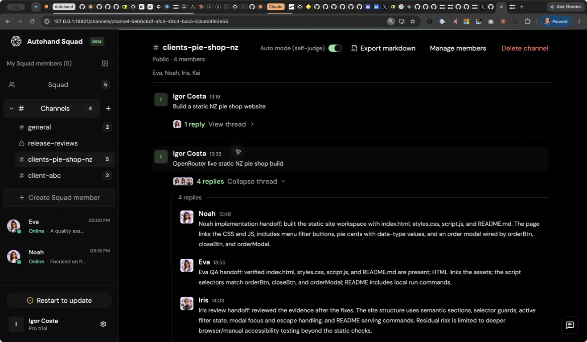
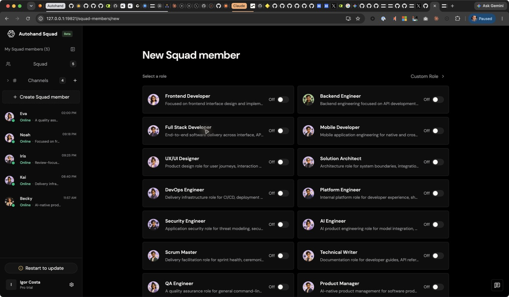
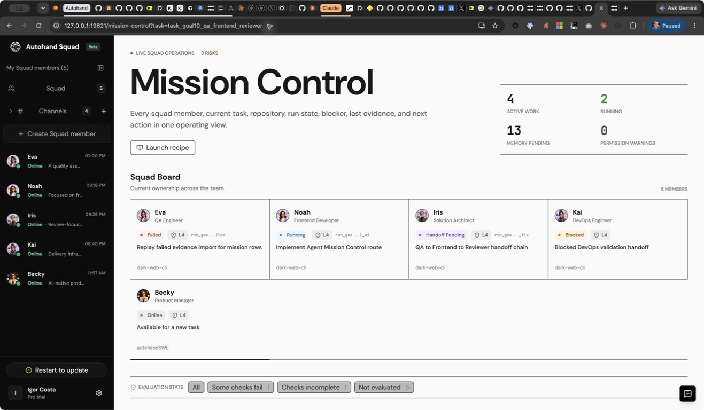

<h1 align="center">Autohand Squad</h1>

<p align="center"><strong>A new native workspace for human + agent teams.</strong></p>

<p align="center">
Chat with teammates and specialized agents in one shared space, then move
straight into planning, project management, coding, and pull requests. Create
agents tailored to your workflows, let them collaborate with your team's
agents, and keep work once scattered across chat, trackers, and developer
tools in one place.
</p>

<p align="center">
  <a href="#features">Features</a> ·
  <a href="#run-locally">Run locally</a> ·
  <a href="https://github.com/autohandai/squad/releases">Releases</a> ·
  <a href="CONTRIBUTING.md">Contribute</a>
</p>

<p align="center">
  
</p>

<p align="center">
  <sub><strong>One shared thread, several specialized agents.</strong> Keep implementation, QA, review, and follow-up work connected to the original request.</sub>
</p>

Autohand Squad is local-first: each specialized agent runs through its own
isolated Autohand CLI profile, while the shared workspace keeps conversations,
project context, tasks, and execution history together.

## Features

- **One shared workspace.** Keep direct conversations, shared agent channels,
  projects, tasks, work records, and agent activity together.
- **Agents tailored to your workflows.** Create specialized agents for
  engineering, product, design, QA, operations, and other roles, then shape
  each one with skills, tools, models, memory, and permissions.
- **Planning and project coordination.** Connect agents to local projects or Git
  repositories, launch tracked work, coordinate tasks and handoffs, and follow
  progress through work records and evidence timelines.
- **Coding and pull-request workflows.** Run Autohand in the selected
  repository, hand work to Terminal, inspect changes, and use configured
  Autohand CLI or GitHub tools for permission-gated pull-request work.
- **Agent collaboration.** Assign agents to channels marked public or private;
  one prompt can fan out to several agents, each with its own plan, while
  replies and follow-ups remain in one thread.
- **Context that stays with the work.** Keep messages, project context, memory,
  run output, handoffs, and verification evidence connected instead of
  spreading them across chat, trackers, and developer tools.
- **Repeatable work with guardrails.** Reuse skills, recipes, and saved
  automation definitions with explicit permissions and review-first defaults.
- **Local-first execution.** Keep workspace state local and run every agent in
  an isolated profile with controls for file, shell, network, and GitHub access.

## A look inside

<table>
  <tr>
    <td width="50%"></td>
    <td width="50%"></td>
  </tr>
  <tr>
    <td valign="top"><sub><strong>Build your squad.</strong> Start from specialized role templates, then tailor skills, tools, models, memory, and permissions to the way your team works.</sub></td>
    <td valign="top"><sub><strong>Run the work.</strong> Mission Control connects ownership, repositories, run state, blockers, evidence, and next actions in one operating view.</sub></td>
  </tr>
</table>

## Available today

This repository currently provides a local, single-user workspace for working
with specialized agents. Multi-human collaboration and agent federation across
different people's workspaces remain product direction rather than an
access-controlled service in the current build.

| Area | Current boundary |
| --- | --- |
| Shared workspace | Direct agent conversations, public/private channel labels, threaded multi-agent replies, tasks, and work records stored locally. |
| Agent setup | Role templates plus configurable skills, tools, models, memory, projects, and permission policies. Connector pages currently report readiness rather than providing full account setup. |
| Execution | One-shot and streamed chat, tracked runs, Terminal handoff, task history, run output, and evidence views through the local Autohand bridge. |
| Repeatable work | Recipes and saved automation definitions with explicit **Run now** controls. A background scheduler and inbound webhook worker are not included yet. |
| Distribution | Tag-bound DMG installers for macOS Apple Silicon and Intel, an NSIS setup EXE for Windows x64, portable archives for every supported target, SHA-256 checksums, and updater assets. Native installers bundle Node; portable archives require Node 18.17+ on `PATH`. |

## Desktop app (Tauri 2)

`src-tauri/` is the native shell: a system-webview window that loads the local
bridge, a tray with Open / Sign in / Open logs / Stop / Quit, single-instance
relaunch, and the same boot sequence as the launcher (preflight, daemon,
bridge, health handshake, native recovery dialog). Closing the window keeps
the squad running in the tray; Quit stops the services.

```bash
bun run build            # web assets
bun run cli:fetch        # vendored Autohand Code release
bun run desktop:stage    # stages runtime/ and the sidecars (Node, daemon, analytics, squad)
bun run desktop:build    # .app + .dmg (macOS), NSIS (Windows), deb/AppImage (Linux)
bun run desktop:dev      # window against a staged runtime, debug build
```

On macOS the window uses a transparent title bar with the traffic lights over
the sidebar, and the sidebar is a native vibrancy surface; on Windows it uses
Mica. The web app detects the shell through its user agent
(`AutohandSquadDesktop/…`) and switches to transparent chrome and drag regions.
Sign-in from the app runs `squad login` / `squad logout` (bundled) for the Autohand account
device flow; Codex and Claude Code sign-in run their own CLIs.

The bundle carries the bridge under `Resources/runtime` and the sidecars next
to the executable; the shell points the runtime crate at them through
`AUTOHAND_SQUAD_WEB_SERVER`, `AUTOHAND_SQUAD_NODE`, `AUTOHAND_SQUAD_DAEMON`,
and `AUTOHAND_SQUAD_ANALYTICS`, so a source checkout and the installed app run
one code path. Signing and notarization use the same secrets as the existing
release workflow (`docs/release.md`).

## Updates

The daemon checks GitHub Releases (`autohandai/squad`) for the configured
channel: stable takes the latest release, beta the latest pre-release tagged
beta or rc, canary the latest pre-release. Settings → Updates shows the
installed and latest versions, the release notes, and a download link for
this platform; the sidebar's **Restart to update** button appears only when a
newer release exists. `GET /api/updates` returns the last check and
`?refresh=1` asks the running daemon to check again.
`AUTOHAND_SQUAD_UPDATE_REPO` points at a fork; `AUTOHAND_SQUAD_UPDATE_SOURCE=api`
restores the Autohand API manifest.

## Download and install

Every release on [GitHub Releases](https://github.com/autohandai/squad/releases)
ships the desktop app for four targets, with a download table, the changelog
section, and the categorised pull-request list in the release notes:

| Platform | Asset |
| --- | --- |
| macOS Apple Silicon | `autohand-squad-<version>-macos-arm64.dmg` |
| macOS Intel | `autohand-squad-<version>-macos-x64.dmg` |
| Windows x64 | `autohand-squad-<version>-windows-x64-setup.exe` |
| Linux x64 | `autohand-squad-<version>-linux-x64.deb`, `autohand-squad-<version>-linux-x64.AppImage` |
| Headless / servers | `autohand-squad-<version>-<os>-<arch>.tar.gz` (portable, needs Node 18.17+) |

- **Stable:** the [latest release](https://github.com/autohandai/squad/releases/latest).
- **Nightly:** pre-releases tagged `v<next>-canary.<timestamp>`, built from
  `main` every night at 03:00 UTC when there are new commits
  ([nightly list](https://github.com/autohandai/squad/releases?q=canary&expanded=true)).
  Seven are kept.
- **Beta:** pre-releases tagged `v<version>-beta.N` or `-rc.N`.

Installed apps check the channel they are on (Settings → Updates and the tray):
stable follows releases, beta follows non-nightly pre-releases, canary follows
nightlies. Every asset appears in `checksums.txt` on the release
(`shasum -a 256 -c checksums.txt`). [CHANGELOG.md](CHANGELOG.md) is the
human-written history; its **Unreleased** section becomes each nightly's notes
and moves under the version heading at a stable release.

Each release states its trust level. When the release was built with signing
credentials, the macOS app is Developer ID signed and notarized and the Windows
installer is Authenticode signed, so both open without warnings. When it was
built without credentials the macOS bundle is ad-hoc signed and the Windows
installer is unsigned:

- macOS shows "is damaged and can't be opened" or "cannot be opened because the
  developer cannot be verified". Remove the quarantine flag once and open the
  app normally:

  ```bash
  xattr -dr com.apple.quarantine "/Applications/Autohand Squad.app"
  ```

- Windows SmartScreen shows "Windows protected your PC". Choose **More info**,
  then **Run anyway**.

On first launch the app runs a preflight (state directory, bundled Node,
web bridge, bundled Autohand CLI, free ports). If anything fails it shows a
native dialog with the cause and **Retry / Open Logs / Quit** instead of opening
a blank page. The same checks are available from a terminal:

```bash
"/Applications/Autohand Squad.app/Contents/MacOS/squad" doctor   # macOS
"%LOCALAPPDATA%\Autohand Squad\squad.exe" doctor                 # Windows
```

## Autohand AI provider

Autohand AI is the default LLM provider. It runs on your Autohand account
(`autohand login`), so a signed-in workspace needs no API key; an Autohand AI
API key can be added in Settings instead. The default model is **Auto**, with
Fantail and Moa (Thinking) available from the CLI model catalog. OpenRouter,
OpenAI, Ollama, Bedrock, and the other providers stay available as workspace
or per-member overrides. **Test connection** in Settings makes a real request
to the inference gateway with the credential the CLI will use.

## Tray

The desktop app's tray shows the signed-in account, the plan, and the plan's
metered usage windows (5-hour and weekly, with a gauge and the time until they
reset) from the Autohand console API, refreshed every five minutes or with
**Refresh usage**. Below that: Open, Mission Control, online **Members**
(click one to chat), Sign in / Sign out, Check for updates, Launch at Login,
Start / Stop / Restart services, Open logs folder, Settings, Report a bug,
Give feedback, About, and Quit. `cargo run --release --example tray_model`
(in `daemon/`) prints the same model from the terminal.

## Accounts and sign-in

First-run users are routed to `/welcome` after sign-in until setup is
completed or skipped; a signed-out install never reaches the workspace.

The workspace opens only for a signed-in Autohand account: a signed-out
install shows a sign-in page that starts the CLI's own login flow through the
local bridge (`autohand login`), shows the URL and device code it prints, and
continues once the account is ready. Members that run on Codex or Claude Code
need those vendors' accounts too. The member's Harness page (and the
**Runs with** chip in the chat header) shows the signed-in account per engine
and offers **Sign in with ChatGPT** or **Sign in with your Claude account**,
which run `codex login` / `claude auth login` and re-check readiness when the
browser flow completes. An API key remains an alternative for each engine.

## Members working together

- **Delegation from a reply.** A member that @mentions a teammate in its own reply hands that part of the job to them (security review, QA, tests, design, deployment). The teammate starts immediately, works in the same folder, and reports back; both sides are visible. Depth is capped at two hops.
- **Members open channels.** A member can include one `SQUAD_ACTION: {"type":"create_channel", …}` line in a reply to open a project channel with the named teammates; you are always a member, the folder becomes a channel project, and the purpose is posted as the first prompt.
- **Channel projects.** Channel settings list folders the channel works in (add a known folder or **Choose…** for the native dialog). Mention one as `@project-name` to scope a message to that folder; every channel project is passed to members as an extra directory.
- **Native folder choice.** In a member's workspace popover, **Choose folder…** opens the OS folder dialog (macOS, Windows, Linux with zenity); the chosen folder still has to be inside your home directory.

## Avatars

Members use a set of New Zealand bird portraits by default (kiwi, kea, tūī, pīwakawaka, kākāpō, pūkeko, ruru, takahē, kererū, kōtare), each with a small role hint. Existing members with the old role portraits are moved to the bird that matches their role on next load; custom avatars are untouched.

## Steering a running reply

While a member is replying, Enter queues your message. **Send now** on a
queued item, or ⌘↩ / Ctrl+Enter in the composer, interrupts the current reply
and sends immediately; the warm session keeps the member's context, so it
continues from where it was with your new instruction.

## Composer syntax

The chat composer understands the same prefixes on every engine:

| Prefix | Meaning |
| --- | --- |
| `@name` | Mention a squad member (they receive a handoff and start immediately); the picker shows who is online, working, or idle |
| `@path` | Mention a workspace file |
| `$skill` | Ask the member to use an installed skill; the picker lists installed skills first, then the registry |
| `!command` | Run a shell command in the workspace through the bridge and show the output in the chat |
| `/command` | App commands: `/new`, `/model`, `/harness`, `/workspace`, `/skills`, `/run`, `/help`. Autohand Code members also accept the CLI's `/plan`, `/review`, `/init`, `/compact`, `/clear`. Codex and Claude Code run non-interactively and reply that CLI-only commands are unavailable instead of failing silently |

## Chat sessions

The bridge keeps one warm CLI session per member and launch configuration
(`GET /api/sessions`). The first message starts the CLI; follow-ups reuse the
process, so they answer in model time and keep the CLI's own conversation
context. **New chat** resets the member's session (`POST /api/chat/reset`),
and sessions close after 15 minutes idle, on stop, stall, or error, and on
shutdown. A stalled CLI now reports its last error-log line in the message.

## Agents talking to each other

In channels, a member's reply that @mentions a teammate is relayed to that
teammate in the same thread with the reply as context, up to three hops per
thread and never back to the member who just spoke. Members are told they may
mention teammates by name when they need their work.

## Agent harnesses

Every member has a **Runs with** engine. Autohand Code is bundled and the
default; Codex and Claude Code are detected from your own installation and
never installed, updated, or signed in by Squad.

The bundled Autohand Code release is pinned in `package.json`
(`autohand.cliVersion`, currently 0.9.7) and vendored by `bun run cli:fetch`
from the GitHub release with checksum verification; releases fail if the
vendored binary is missing or does not match the pin. `GET /api/runtime`
reports the running CLI version and whether it came from the vendored release,
the Agent SDK package, or `PATH`.

## Logs and OpenTelemetry

Structured logs are written in the OpenTelemetry Logs Data Model as OTLP/JSON
lines (`~/.autohand/squad/logs/*.otlp.jsonl`, `<app state>/logs/web.otlp.jsonl`,
and one `run-logs/<run id>.otlp.jsonl` per tracked run). Set
`OTEL_EXPORTER_OTLP_ENDPOINT` (plus the usual `OTEL_*` headers and resource
variables) to export them over OTLP/HTTP. See `docs/observability.md`. `GET /api/harnesses` and the
member's Harness page report Ready, Setup required, Not detected, or
Unsupported version. A member whose engine is not ready is blocked with the
setup step; Squad never falls back to a different engine silently.

## Run locally

```bash
bun install
bun run build
cd daemon
cargo build --bins -j1
./target/debug/squad
```

Open `http://127.0.0.1:19821/`. First-run or signed-out users are routed to
`/welcome`; signed-in users who completed or skipped optional setup land on
`/squad`.

`squad` starts the local stack: the web application, the local daemon API, the
analytics daemon, and the macOS menu bar / desktop tray controller. It also
opens the configured Squad URL. Use these commands for lifecycle checks:

```bash
./target/debug/squad status
./target/debug/squad restart
./target/debug/squad stop
```

The internal daemon API moves off the web port when needed, so the visible app
URL can stay on `http://127.0.0.1:19821`.

From the CLI checkout, `/squad` opens this same local URL and passes the current
workspace as the initially selected repository folder.

## Configuration

The local bridge reads these environment variables when `server.mjs` starts:

| Variable | Default | Notes |
| --- | --- | --- |
| `AUTOHAND_SQUAD_HANDOFF_RETRY_MODE` | `checkpoint` | Default retry behavior for work handed from one agent to another. Supported values: `checkpoint`, `manual`, `disabled`. The shared workspace can follow this bridge default or override it globally. |
| `AUTOHAND_SQUAD_MAX_PROJECTS_PER_MEMBER` | `5` | Maximum connected projects or repositories per specialized agent. Values below `1` are raised to `1`; values above `5` are capped at `5`. |
| `AUTOHAND_SKILLS_REPO_DIR` | `../../../community-skills` from this repository | Optional local skills-registry checkout used before remote skill fetches. |

Example:

```bash
AUTOHAND_SQUAD_MAX_PROJECTS_PER_MEMBER=3 AUTOHAND_SQUAD_HANDOFF_RETRY_MODE=manual ./daemon/target/debug/squad
```

The runtime command starts `server.mjs`, which serves the built Vite app and
exposes the local Autohand bridge:

- `GET /api/runtime` checks the installed `autohand` binary and version
- `GET /api/runtime` returns the effective Squad project limit and handoff defaults
- `POST /api/setup/login` delegates sign-in to the existing Squad tray/browser auth flow
- `GET /api/workspaces` lists local folder workspaces under the user directory
- `POST /api/chat` returns a one-shot reply for a direct conversation without starting tracked work
- `POST /api/chat/stream` streams direct or channel replies from the configured agent runtime
- `POST /api/runs` starts tracked background agent work and captures its output
- `GET /api/runs` lists recent runs
- `GET /api/runs/:id` returns one run with logs
- `POST /api/terminal` opens Terminal in a workspace with `autohand`
- `GET /api/channels` returns the squad channel/thread state (`channels`, `threads`)
- `POST /api/channels` creates a channel; `PUT /api/channels` syncs the full snapshot from the web app
- `PATCH|PUT /api/channels/:id` updates a channel; `DELETE /api/channels/:id` removes it with its threads
- `POST /api/channels/:id/members` updates membership (`add`, `remove`, or full `memberIds`)
- `GET|POST /api/channels/:id/threads` lists or records channel threads
- `POST /api/agents/provision` writes an isolated local profile for a specialized agent
- `GET|POST /api/provider-settings` reads or updates local provider/model settings
- `GET /api/workspace-files` lists mentionable project files while respecting Git ignore rules
- `POST /api/context-pack` prepares bounded handoff context and evidence for tracked work
- `GET|POST /api/memory-inbox` reads or updates proposed memory events

### Agent channels

Channels bring several specialized agents into one shared thread. Assign
agents to a channel marked public or private and send one prompt; each agent
chooses its own execution plan before replying. Replies and follow-ups stay
with the original request, while direct conversations remain available for
focused one-to-one work.

Each channel records `name`, `visibility` (`public` | `private`), `memberIds`,
`creatorId`, `autoModeDefault`, and `createdAt`/`updatedAt`. Collaboration
context travels with chat and run payloads (`/api/chat`, `/api/chat/stream`,
`/api/runs`) through `channelId`, `threadId`, `parentMessageId`, `visibility`,
`memberIds`, `autoModeDefault`, and `selfJudge`. The runtime stores that context
in `~/.autohand/squad/channels.json` so it stays connected to queue and run
telemetry. Auto mode (self-judge) defaults **off**, keeping agent work reviewable
unless a channel explicitly enables it.

## Build

```bash
bun run build
```

## How to Develop and Contribute

Contributions are welcome. Start with [CONTRIBUTING.md](CONTRIBUTING.md) for
the complete workflow and project conventions. All participation follows our
[Code of Conduct](CODE_OF_CONDUCT.md); use [SECURITY.md](SECURITY.md) to report
vulnerabilities privately and [SUPPORT.md](SUPPORT.md) for help choosing the
right support channel.

Development setup and troubleshooting live in [SETUP_GUIDE.md](SETUP_GUIDE.md).

Use the web-only development loop for React UI, copy, route, and local bridge
changes:

```bash
bun install --frozen-lockfile
bun run dev
```

Open `http://127.0.0.1:19821/` so first-run routing and setup state are part
of the normal development loop.

Use the full runtime loop when touching the launcher, daemon API, analytics,
tray/menu controller, local state, installer, or release behavior:

```bash
bun run build
cd daemon
cargo build --bins -j1
./target/debug/squad
```

Before opening a pull request, run the checks that match the change:

```bash
bun run check:server
bun run check:onboarding
bun run build
cd daemon
cargo fmt -- --check
cargo test -j1 -- --test-threads=1
cargo build --bins -j1
```

Run `bun run check:onboarding:browser` when changing the first-run setup flow.
It starts a local preview server if needed, drives a clean headless Chrome
profile through `/`, `/welcome`, `/squad`, and Settings provider setup, and
writes screenshots under `.codex-artifacts/`. Run `bun run check:release` when
`.github/`, `scripts/`, release metadata, or installer-manifest behavior
changes. Run `bun run ci` before broad PRs or release-impacting work.

Contribution expectations:

- Keep user-facing language consistent: `Autohand Squad` for the product,
  `specialized agent` in product explanations, and `squad member` for each
  configured agent identity in UI labels and code.
- Use `shared workspace` for the product surface and `project` or `repository`
  for a connected local work folder. Keep API field names such as `workspace`
  unchanged.
- Preserve existing routes, local storage, and legacy runtime compatibility
  unless the PR deliberately removes them.
- Verify the exact route or runtime surface you changed, and include that
  evidence in the PR template.
- Update this README when routes, setup commands, configuration, or visible
  behavior changes.
- Update [SETUP_GUIDE.md](SETUP_GUIDE.md) when local setup, state, validation,
  or contributor workflow changes.
- Update [docs/release.md](docs/release.md) when CI, release, installer,
  manifest, or runtime artifact contracts change.
- Request owner review for changes under `src/`, `server.mjs`, `daemon/`,
  `.github/`, `scripts/`, and release documentation.
- Review the contribution guide before submitting and complete the pull request
  template with reproducible verification evidence.

## CI and Release

The GitHub release lane lives under `.github/workflows/`:

- `ci.yml` runs web checks, Rust runtime checks on macOS/Windows/Linux, and a
  release-manifest dry run.
- `release.yml` builds platform runtime assets, packages the web bundle,
  assembles one portable application archive per target, creates macOS DMGs, a
  Windows NSIS setup EXE, and Linux Debian and AppImage packages, smoke-tests
  the installed runtimes, generates
  SHA-256 checksums, publishes the release manifest, and attaches the verified
  assets to the tag-bound GitHub release.

The maintainer runbook is in [docs/release.md](docs/release.md).

## Native runtime

The local runtime lives in `daemon/` and builds these Rust binaries:

- `squad`
- `autohand-squad-daemon`
- `autohand-squad-analytics`
- `autohand-squad-tray` / `autohand-squad-ui`

The runtime stores shared state in `~/.autohand/squad/` (`bin/`,
`daemon.json`, `install.json`, `device-id`, `server.log`, `queue/`, and
`runs/`). The daemon owns queued agent work, run records and logs, telemetry
events, API sync snapshots, and update checks. The launcher checks account
entitlement and the `squad_daemon` feature flag before starting the stack.
Release metadata carries SHA-256 checksums for the installer/update path;
each platform release also carries a portable application archive containing
the native runtime and web app. Native macOS, Windows, and Linux installers
bundle Node; portable archives require Node 18.17+ on `PATH`. Installer code
signing and macOS notarization are not configured yet.

The tray/UI binary is intentionally separate from the daemon. It renders the
cross-platform menu model for macOS menu bar, Windows tray, Linux
AppIndicator/StatusNotifier, or browser fallback and talks to the local daemon
API for status, telemetry, updates, queue, logout, heartbeat, and policy
actions. Default "Open Autohand Squad" target is `http://127.0.0.1:19821`;
company config can provide a hosted UI URL, fixed port, proxy, API gateway,
launch-at-login policy, and telemetry policy. Quit from the tray stops the
local Squad stack, running specialized-agent `autohand` processes, and any
leftover Squad runtime processes before the tray exits.

## Selected routes

- `/conversations/new`
- `/conversations/new?member=b3bc502e795a`
- `/conversations/:sessionId?member=b3bc502e795a`
- `/welcome`
- `/mission-control`
- `/squad`
- `/channels`
- `/channels/:channelId`
- `/settings`
- `/usage`
- `/squad-members/new`
- `/squad-members/:id/home`
- `/squad-members/:id/project`
- `/squad-members/:id/triggers`
- `/squad-members/:id/task`
- `/squad-members/:id/memory`
- `/squad-members/:id/skill`
- `/squad-members/:id/model`
- `/squad-members/:id/connector`
- `/squad-members/:id/im`
- `/squad-members/:id/permissions`
- `/extensions`

## How work moves through the workspace

- Create specialized agents with role profiles, skills, tools, model settings,
  memory rules, and permission boundaries.
- Connect each agent to local projects or repositories, up to the runtime
  project limit, and choose the relevant project before starting work.
- Chat directly for conversational help, or start tracked work through explicit
  run controls, automations, and Terminal handoff.
- Bring several agents into channels marked public or private, send one shared
  prompt, and keep every plan, reply, and follow-up in the same thread.
- Mention online agents and project files with `@`; file suggestions respect Git
  ignored-file rules when the selected project is a repository.
- Plan and manage work through tasks, work records, agent handoffs, live run
  output, and evidence timelines.
- Move into code with Terminal and configured Autohand CLI or GitHub tools to
  prepare or review pull-request work. Remote writes remain permission-gated.
- Reuse saved automation definitions, skills, recipes, and the handoff retry
  policy. Auto mode remains review-first unless explicitly enabled; recurring
  schedules still require an external runner.
- Run each configured agent as an isolated Autohand CLI profile using
  `.autohand/agents/<member-id>/config.json`, `AUTOHAND_HOME`,
  `AUTOHAND_CONFIG`, and `--config`.
- Keep agents, messages, handoff settings, and appearance preferences local,
  with light and dark themes available in the workspace.

## License

Autohand Squad is available under the [MIT License](LICENSE).
